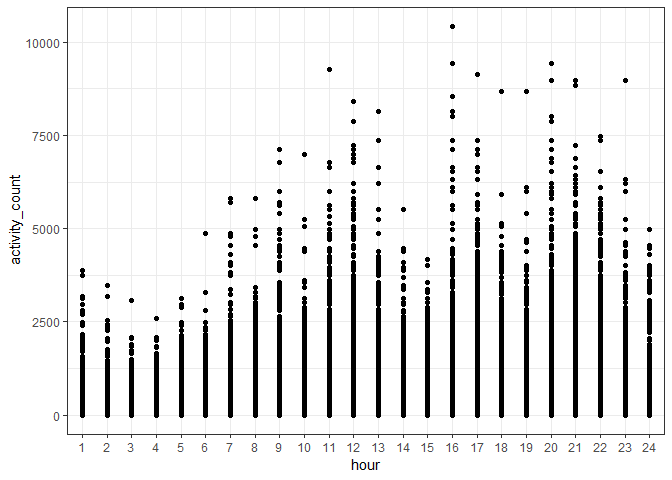
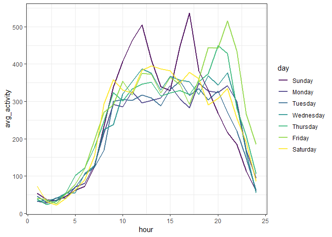
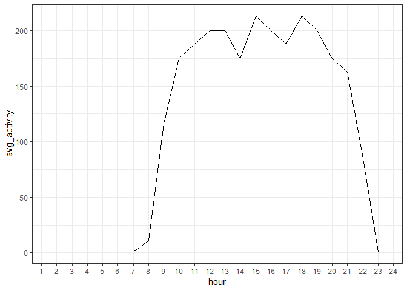
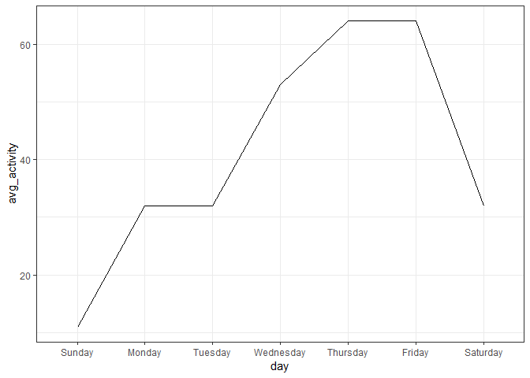

P8105 Midterm
================
Nick Williams

Importing data
--------------

``` r
accel_data <- read_csv("./data/p8105_mtp_data.csv") %>% 
  janitor::clean_names()
```

    ## Parsed with column specification:
    ## cols(
    ##   .default = col_double(),
    ##   week = col_integer(),
    ##   day = col_character()
    ## )

    ## See spec(...) for full column specifications.

Cleaning data
-------------

``` r
accel_data <- accel_data %>% 
  gather(key = "minute", value = "activity_count", activity_1:activity_1440) %>% 
  separate(minute, into = c("drop", "minute"), sep = "_") %>% 
  select(-drop) %>% 
  mutate(day = as_factor(day), 
         day = fct_relevel(day, c("Sunday", "Monday", "Tuesday", "Wednesday", 
                                  "Thursday", "Friday", "Saturday")),
         minute = as.integer(minute), 
         hour = cut(minute, breaks = c(-Inf, 61, 121, 181, 241, 301, 361, 
                                       421, 481, 541, 601, 661, 721, 781, 
                                       841, 901, 961, 1021, 1081, 1141, 1201, 
                                       1261, 1321, 1381, 1441), 
                    labels = c(1, 2, 3, 4, 5, 6, 7, 8, 9, 10, 11, 12, 
                               13, 14, 15, 16, 17, 18, 19, 20, 21, 22, 23, 24)
         )
  )
```

### Exploratory analyses plots

``` r
accel_data %>% 
  ggplot(aes(x = day, y = activity_count)) + 
  geom_violin() + 
  scale_y_continuous(trans = "log")
```


``` r
accel_data %>% 
  ggplot(aes(x = hour, y = activity_count)) + 
  geom_point() 
```



``` r
accel_data %>% 
  group_by(hour) %>% 
  summarize(avg_activity = mean(activity_count)) %>% 
  ggplot(aes(x = hour, y = avg_activity, group = 1)) +
  geom_line()
```



``` r
accel_data %>% 
  group_by(hour) %>% 
  summarize(avg_activity = median(activity_count)) %>% 
  ggplot(aes(x = hour, y = avg_activity, group = 1)) +
  geom_line()
```



``` r
accel_data %>% 
  group_by(day) %>% 
  summarize(avg_activity = median(activity_count)) %>% 
  ggplot(aes(x = day, y = avg_activity, group = 1)) +
  geom_line()
```


