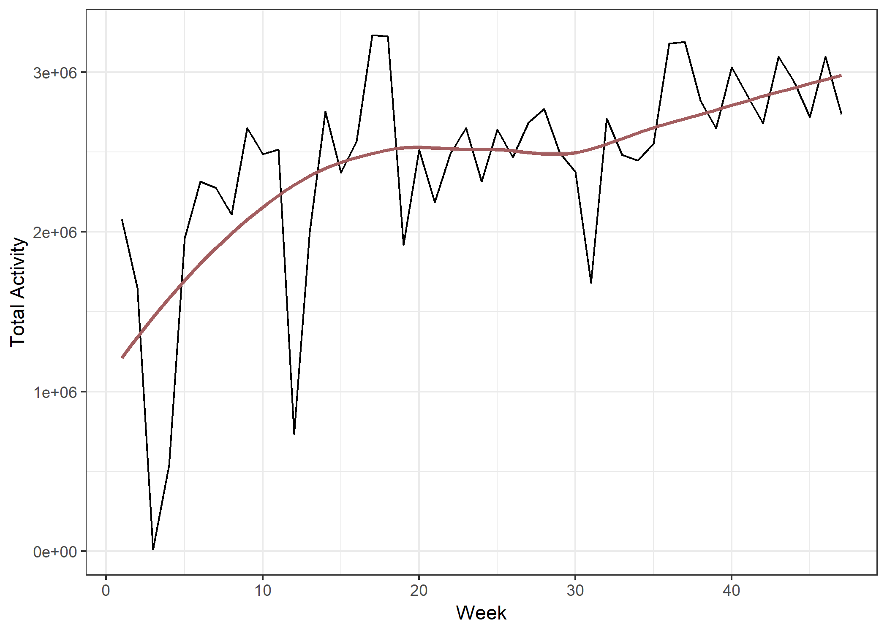

P8105 Midterm
================
Nick Williams

### Importing data

``` r
accel_data <- read_csv("./data/p8105_mtp_data.csv") %>% 
  janitor::clean_names()
```

### Cleaning data

``` r
accel_data <- accel_data %>% 
  gather(key = "minute", value = "activity_count", activity_1:activity_1440) %>% 
  separate(minute, into = c("axe", "minute"), sep = "_") %>% 
  select(-axe) %>% 
  mutate(day = as_factor(day), 
         day = fct_relevel(day, c("Sunday", "Monday", "Tuesday", "Wednesday", 
                                  "Thursday", "Friday", "Saturday")),
         minute = as.integer(minute), 
         hour = cut(minute, breaks = c(-Inf, 61, 121, 181, 241, 301, 361, 
                                       421, 481, 541, 601, 661, 721, 781, 
                                       841, 901, 961, 1021, 1081, 1141, 1201, 
                                       1261, 1321, 1381, 1441), 
                    labels = c(1, 2, 3, 4, 5, 6, 7, 8, 9, 10, 11, 12, 
                               13, 14, 15, 16, 17, 18, 19, 20, 21, 22, 23, 24)
         ), 
         week_fct = as.factor(week), 
         week_fct = fct_collapse(week_fct, 
                              "1 - 9" = c("1", "2", "3", "4", "5", "6", "7", "8", "9"), 
                              "10 - 19" = c("10", "11", "12", "13", "14", "15", "16", "17", "18", "19"), 
                              "20 - 29" = c("20", "21", "22", "23", "24", "25", "26", "27", "28", "29"), 
                              "30 - 39" = c("30", "31", "32", "33", "34", "35", "36", "37", "38", "39"), 
                              "40 - 47" = c("40", "41", "42", "43", "44", "45", "46", "47"))
  )
```

### Exploratory analyses plots

``` r
density_full <- accel_data %>% 
  mutate(log_actvty_count = log(activity_count)) %>% 
  ggplot(aes(x = log_actvty_count, color = week_fct)) +
  geom_density(size = 0.75, fill = "grey", alpha = 0.1) + 
  viridis::scale_color_viridis(discrete = TRUE, 
                               name = "Week", 
                               option = "cividis") + 
  labs(x = "Log Activity Count", 
       y = "Density") + 
  theme(legend.position = c(.93, .68), 
        legend.key.size = unit(.1, "in"),
        legend.title = element_text(size = 10), 
        legend.background = element_blank(), 
        legend.box.background = element_rect(color = "black"))

density_zoom_1 <- accel_data %>% 
  mutate(log_actvty_count = log(activity_count)) %>% 
  ggplot(aes(x = log_actvty_count, color = week_fct)) +
  geom_density(size = 0.75, fill = "grey", alpha = 0.1) + 
  coord_cartesian(xlim = c(0, 1)) + 
  viridis::scale_color_viridis(discrete = TRUE, 
                               guide = FALSE, 
                               option = "cividis") + 
  labs(caption = "Log activity zoomed between 0 and 1") + 
  theme(axis.title.x = element_blank(), 
        axis.title.y = element_blank())

density_zoom_2 <- accel_data %>% 
  mutate(log_actvty_count = log(activity_count)) %>% 
  ggplot(aes(x = log_actvty_count, color = week_fct)) +
  geom_density(size = 0.75, fill = "grey", alpha = 0.1) + 
  coord_cartesian(xlim = c(2, 8), ylim = c(0, 0.3)) + 
  viridis::scale_color_viridis(discrete = TRUE, 
                               guide = FALSE, 
                               option = "cividis") +  
  labs(caption = "Log activity zoomed between 2 and 8") + 
  theme(axis.title.x = element_blank(), 
        axis.title.y = element_blank())

wrap_elements(density_full / (density_zoom_1 + density_zoom_2)) + 
  ggtitle("Density plots of log activity count with zoomed axis")
```


``` r
accel_data %>% 
  group_by(day) %>% 
  mutate(log_actvty = log(activity_count)) %>% 
  summarize(geo_avg_actvty = exp(mean(log_actvty))) %>%
  ggplot(aes(x = day, y = geo_avg_actvty)) + 
  geom_point(size = 4, color = "#A35E60") + 
  geom_line(group = 1) + 
  labs(title = "Geometric average activity count by the day of the week", 
       x = "Day of the week", 
       y = "Geometric average activity count", 
       caption = "Data provided by Jeff Goldmsith, PhD")
```



``` r
med_actvty_all_days <- accel_data %>% 
  group_by(hour) %>% 
  summarize(med_activity = median(activity_count)) %>% 
  mutate(day = as.factor("All days"), 
         hour = as.double(hour))

accel_data %>% 
  mutate(hour = as.double(hour)) %>% 
  group_by(hour, day) %>% 
  summarize(med_activity = median(activity_count)) %>% 
  ggplot(aes(x = hour, y = med_activity, color = day)) +
  geom_line(size = 1, alpha = 0.5) + 
  geom_line(data = med_actvty_all_days, lty = "dashed", size = 1.5) + 
  viridis::scale_color_viridis(name = "Day of the week", 
                               discrete = TRUE, 
                               option = "cividis",
                               breaks = c("All days", "Sunday", "Monday", "Tuesday",
                                          "Wednesday", "Thursday", "Friday", "Saturday")) + 
  scale_x_continuous(limits = c(0, 24), 
                     breaks = c(0, 2, 4, 6, 8, 10, 12, 14, 16, 18, 20, 22, 24)) + 
  scale_y_continuous(minor_breaks = seq(0, 300, 25)) + 
  labs(title = "Activity count throughout the day stratified by day of the week",
       x = "Hour of the Day (24 hour clock)", 
       y = "Median Activity Count", 
       caption = "Data provided by Jeff Goldsmith, PhD") + 
  theme(legend.position = c(.05, 1), 
        legend.justification = c(0, 1.1), 
        legend.key.size = unit(.1, "in"),
        legend.title = element_text(size = 10), 
        legend.background = element_blank(), 
        legend.box.background = element_rect(color = "black"))
```


``` r
med_actvty_week_day <- accel_data %>% 
  group_by(week, day) %>% 
  summarize(med_actvty = median(activity_count)) %>% 
  ggplot(aes(x = week, y = med_actvty)) + 
  facet_grid(~ day) + 
  geom_line() + 
  labs(y = "Median Activity Count") +
  geom_smooth(color = "#A35E60", size = 1, se = FALSE) + 
  theme(strip.background = element_blank(),
        strip.text = element_text(color = "black"),
        axis.text.x = element_blank(), 
        axis.title.x = element_blank()
  )

mean_actvty_week_day <- accel_data %>% 
  group_by(week, day) %>% 
  mutate(log_actvty = log(activity_count)) %>% 
  summarize(geo_avg_actvty = exp(mean(log_actvty))) %>% # using geometric mean due to how skewed data is
  ggplot(aes(x = week, y = geo_avg_actvty)) + 
  facet_grid(~ day) + 
  geom_line() + 
  labs(x = "Week", 
       y = "Geometric Mean Activity Count") + 
  geom_smooth(color = "#A35E60", se = FALSE) + 
  theme(strip.background = element_blank(), 
        strip.text = element_blank())

wrap_elements(med_actvty_week_day / mean_actvty_week_day) + 
  ggtitle("Median and mean activity count over time stratified by the day of the week")
```


